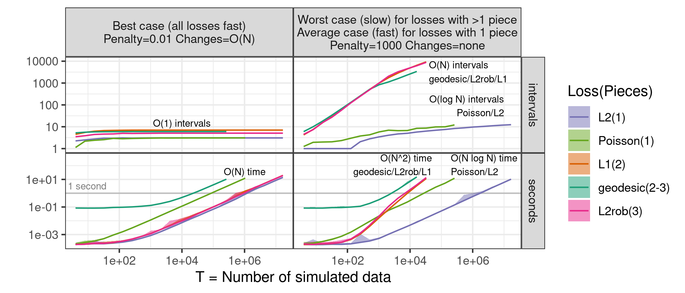
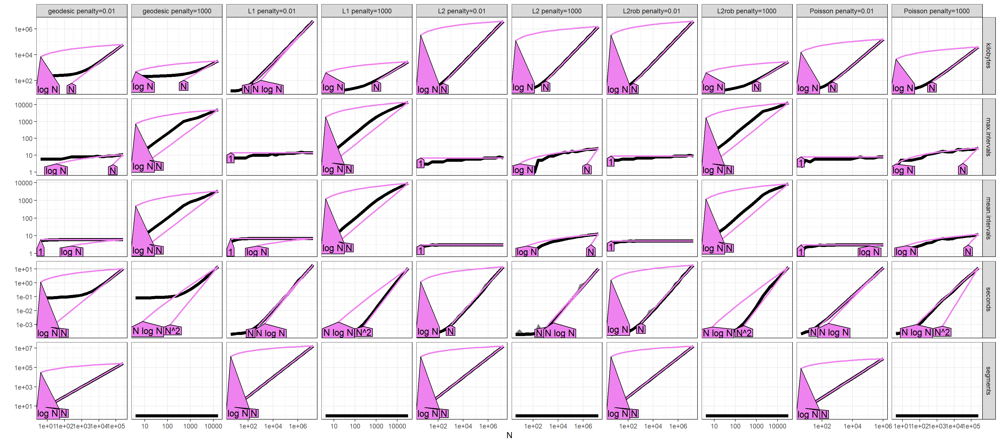
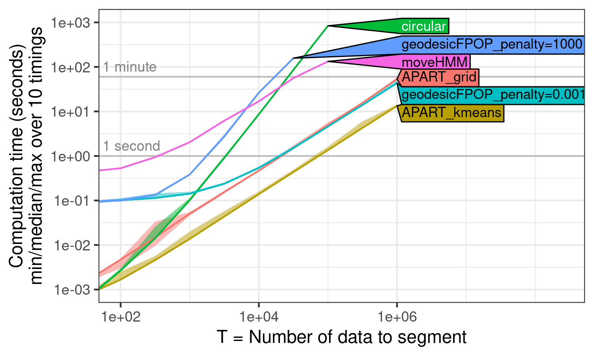
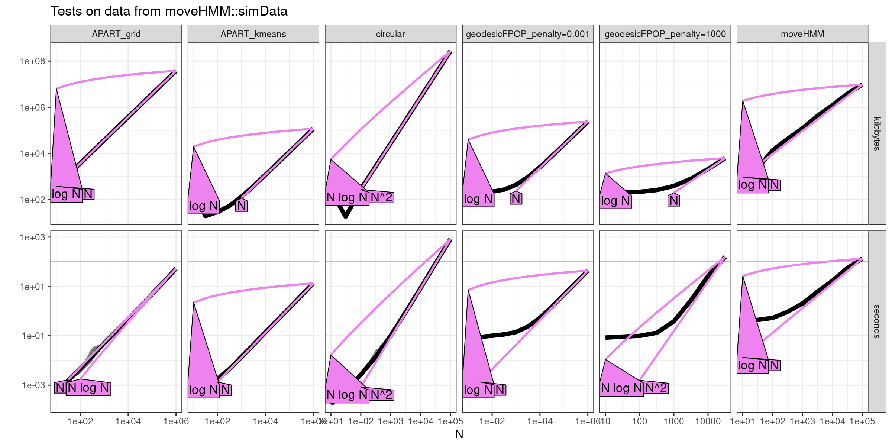
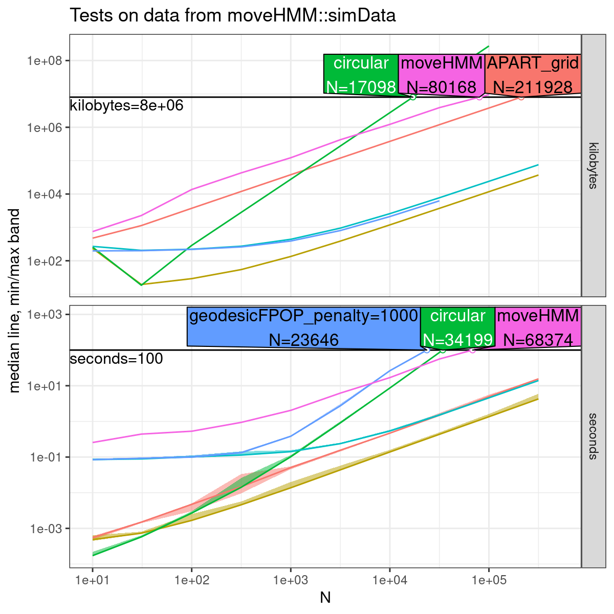

# Figures for paper

* time complexity of angular changepoint
  packages. [PNG](figure-compare-time-sim-nopred-nomem.png),
  [timings code](figure-compare-time-sim-data.R), 
  [figure code](figure-compare-time-sim.R).
* time complexity of FPOP with different loss
  functions. [PNG](figure-geodesicFPOP-robseg-simple.png),
  [timings code](figure-geodesicFPOP-robseg-data.R),
  [figure code](figure-geodesicFPOP-robseg.R).
  
# 3 oct 2024

[msmbuilder.hmm.VonMisesHMM](http://msmbuilder.org/3.4.0/_hmm/msmbuilder.hmm.VonMisesHMM.html)

```shell
conda install -c omnia msmbuilder
```

[source is C++](https://github.com/msmbuilder/msmbuilder/blob/master/msmbuilder/hmm/src/VonMisesHMMFitter.cpp)
  
# 19 Sept 2024

[figure-2d-hmm-sim.R](figure-2d-hmm-sim.R) makes


  
# 3 July 2024

[interesting_signals.py](interesting_signals.py) has indices of real
data with segments near the boundary.

[figure-2d-hmm-real-interactive.R](figure-2d-hmm-real-interactive.R)
makes 
[interactive HMM data viz](https://tdhock.github.io/2024-07-04-HMM-angular-data/)


  
# 28 June 2024

[figure-2d-hmm.R](figure-2d-hmm.R) makes

 

# 18 Apr 2024

[figure-pointer-moves.R](figure-pointer-moves.R) makes

 

# 16 Apr 2024

[figure-geodesicFPOP-robseg.R](figure-geodesicFPOP-robseg.R) makes





[figure-geodesic-penalties.R](figure-geodesic-penalties.R) makes


# 10 Apr 2024

[figure-approx-algo-1d.R](figure-approx-algo-1d.R) makes


# 2 Apr 2024

[figure-compare-time-data.R](figure-compare-time-data.R) makes


[figure-compare-time-sim-data.R](figure-compare-time-sim-data.R) makes







https://cloud.r-project.org/web/packages/moveHMM

https://cloud.r-project.org/web/packages/circular

# 3 Mar 2024

Modified robseg [figure-robseg.R](figure-robseg.R)
https://github.com/tdhock/robust-fpop/tree/interval-count shows that
number of intervals is indeed linear if penalty is large.

```r
      lambda lthreshold lslope intervals  path
       <num>      <num>  <num>     <int> <int>
   1:    100          1      0         3    -1
   2:    100          1      0         5    -1
   3:    100          1      0         7    -1
   4:    100          1      0         9    -1
   5:    100          1      0        11    -1
  ---                                         
 996:    100          1      0       724    -1
 997:    100          1      0       722    -1
 998:    100          1      0       724    -1
 999:    100          1      0       723    -1
1000:    100          1      0       726    -1
      lambda lthreshold lslope intervals  path
       <num>      <num>  <num>     <int> <int>
   1:    0.1          1      0         3    -1
   2:    0.1          1      0         5     1
   3:    0.1          1      0         5     2
   4:    0.1          1      0         5     3
   5:    0.1          1      0         5     4
  ---                                         
 996:    0.1          1      0         5   994
 997:    0.1          1      0         6   996
 998:    0.1          1      0         6   995
 999:    0.1          1      0         7   998
1000:    0.1          1      0         5   999
## Above biweight, below L1.
      lambda lthreshold lslope intervals  path
       <num>      <num>  <num>     <int> <int>
   1:    100          0     -1         3    -1
   2:    100          0     -1         5    -1
   3:    100          0     -1         7    -1
   4:    100          0     -1         9    -1
   5:    100          0     -1        11    -1
  ---                                         
 996:    100          0     -1       787    -1
 997:    100          0     -1       786    -1
 998:    100          0     -1       788    -1
 999:    100          0     -1       787    -1
1000:    100          0     -1       788    -1
      lambda lthreshold lslope intervals  path
       <num>      <num>  <num>     <int> <int>
   1:    0.1          0     -1         3    -1
   2:    0.1          0     -1         7     1
   3:    0.1          0     -1         7     2
   4:    0.1          0     -1         7     3
   5:    0.1          0     -1         7     4
  ---                                         
 996:    0.1          0     -1         7   995
 997:    0.1          0     -1         7   996
 998:    0.1          0     -1         7   997
 999:    0.1          0     -1         7   998
1000:    0.1          0     -1         7   999
> for(lambda in c(100, 0.1)){
+ fit <- PeakSegOptimal::PeakSegFPOP(count.vec, penalty=lambda)
+ fit.dt <- with(fit, data.table(
+ penalty, path=rev(ends.vec), intervals=t(intervals.mat)))
+ print(fit.dt)
+ }
      penalty  path intervals.V1 intervals.V2
        <num> <int>        <int>        <int>
   1:     100    -1            0            1
   2:     100    -1            2            1
   3:     100    -1            2            1
   4:     100    -1            2            1
   5:     100    -1            2            1
  ---                                        
 996:     100    -1            9            7
 997:     100    -1           10            7
 998:     100    -1           11            7
 999:     100    -1           10            7
1000:     100     0           10            8
      penalty  path intervals.V1 intervals.V2
        <num> <int>        <int>        <int>
   1:     0.1    -1            0            1
   2:     0.1    -1            2            1
   3:     0.1    -1            2            3
   4:     0.1    -1            4            4
   5:     0.1    -1            4            5
  ---                                        
 996:     0.1   994            2            4
 997:     0.1   996            4            4
 998:     0.1   997            5            2
 999:     0.1   998            2            3
1000:     0.1   999            3            3
```

Below we show that an ever increasing synthetic data set, with large
penalty, gives linear number of intervals,

```r
> N=10
> count.vec <- as.integer(2^seq(1,N))
> pen.vec <- c(1000000, 0.1)
> for(lambda in pen.vec){
+ fit <- PeakSegOptimal::PeakSegFPOP(count.vec, penalty=lambda)
+ fit.dt <- with(fit, data.table(
+ lambda, path=rev(ends.vec), intervals=t(intervals.mat)))
+ print(fit.dt)
+ rob.fit <- robseg::Rob_seg(count.vec, lambda=lambda, lthreshold=1)
+ print(with(rob.fit, data.table(lambda, t.est, intervals)))
+ }
    lambda  path intervals.V1 intervals.V2
     <num> <int>        <int>        <int>
 1:  1e+06    -1            0            1
 2:  1e+06    -1            1            1
 3:  1e+06    -1            3            1
 4:  1e+06    -1            4            1
 5:  1e+06    -1            5            1
 6:  1e+06    -1            6            1
 7:  1e+06    -1            7            1
 8:  1e+06    -1            8            1
 9:  1e+06    -1            9            1
10:  1e+06     0            9            1
    lambda t.est intervals
     <num> <int>     <int>
 1:  1e+06    10         2
 2:  1e+06    10         3
 3:  1e+06    10         5
 4:  1e+06    10         7
 5:  1e+06    10         9
 6:  1e+06    10        11
 7:  1e+06    10        13
 8:  1e+06    10        15
 9:  1e+06    10        17
10:  1e+06    10        18
    lambda  path intervals.V1 intervals.V2
     <num> <int>        <int>        <int>
 1:    0.1    -1            0            1
 2:    0.1     0            1            1
 3:    0.1     2            2            2
 4:    0.1     3            4            2
 5:    0.1     4            4            2
 6:    0.1     5            4            2
 7:    0.1     6            4            2
 8:    0.1     7            4            2
 9:    0.1     8            4            2
10:    0.1     9            4            2
    lambda t.est intervals
     <num> <int>     <int>
 1:    0.1     1         2
 2:    0.1     2         4
 3:    0.1     3         5
 4:    0.1     4         5
 5:    0.1     5         5
 6:    0.1     6         5
 7:    0.1     7         5
 8:    0.1     8         5
 9:    0.1     9         5
10:    0.1    10         4
```

# 29 Feb 2024

[figure-min-l1-2d.R](figure-min-l1-2d.R) makes


# 23 Feb 2024

[avocados.py](avocados.py) reads avocados/data_1.pkl etc and saves
avocados/trajectory1458/25.csv.gz etc.

# 7 Feb 2024

For functional pruning L2 loss in sin/cos space, we can use this
formula for finding the intersection of two loss functions
https://www.wolframalpha.com/input?i=a%2Bb*sin%28x%29%2Bc*cos%28x%29%3D0

[figure-loss.R](figure-loss.R) makes


[figure-roots-sin-cos.R](figure-roots-sin-cos.R) makes


[figure-roots-l1-2d.R](figure-roots-l1-2d.R) makes


